# AA Wallet 技术设计文档

> 基于 EIP-7702 的 AA 钱包，实现 Gasless 交易和 USDT 支付 Gas

**版本**: v1.0 | **日期**: 2026-05-15 | **网络**: BSC 测试网

---

## 1. 项目概述

### 1.1 核心特性

| 特性 | 描述 |
|------|------|
| **Gasless 交易** | 用户无需持有 BNB 即可发起交易 |
| **EIP-7702 授权** | EOA 账户临时转换为智能合约账户 |
| **USDT 支付 Gas** | 用 USDT 支付交易费用，无需原生代币 |
| **批量操作** | 单次签名执行多个操作（approve + transfer） |
| **Relayer 网络** | 分布式 Relayer 池代付 Gas，负载均衡 |

### 1.2 技术栈

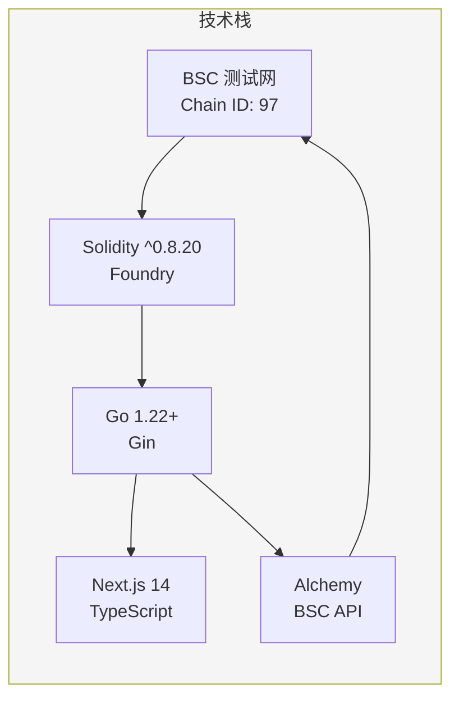

---

## 2. 系统架构

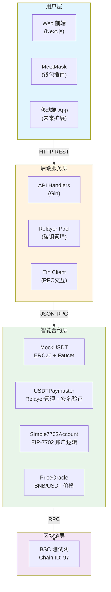

### 2.1 合约地址 (BSC 测试网)

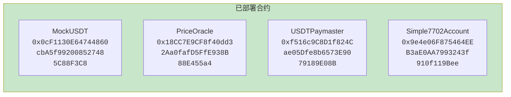

---

## 3. 合约设计

### 3.1 合约依赖关系

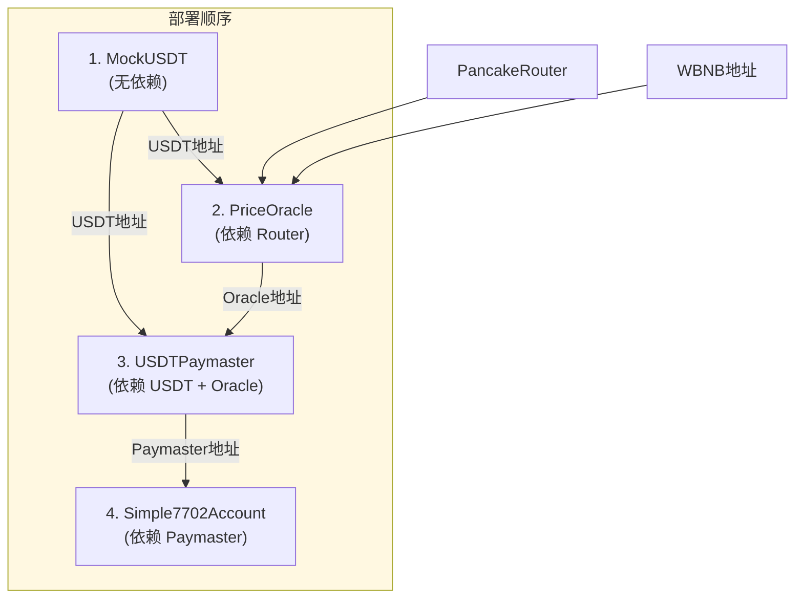

### 3.2 合约调用关系

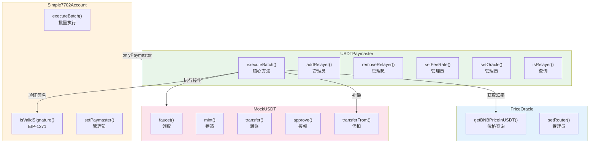

### 3.3 MockUSDT 合约结构

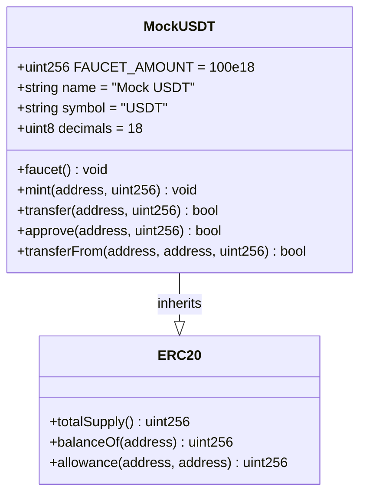

### 3.4 USDTPaymaster 合约结构

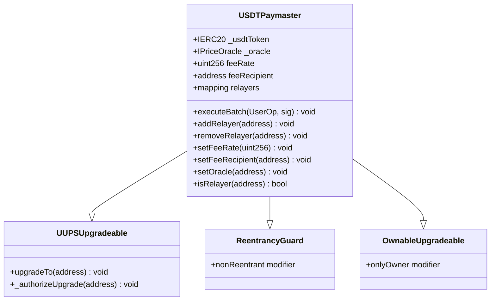

### 3.5 Simple7702Account 合约结构

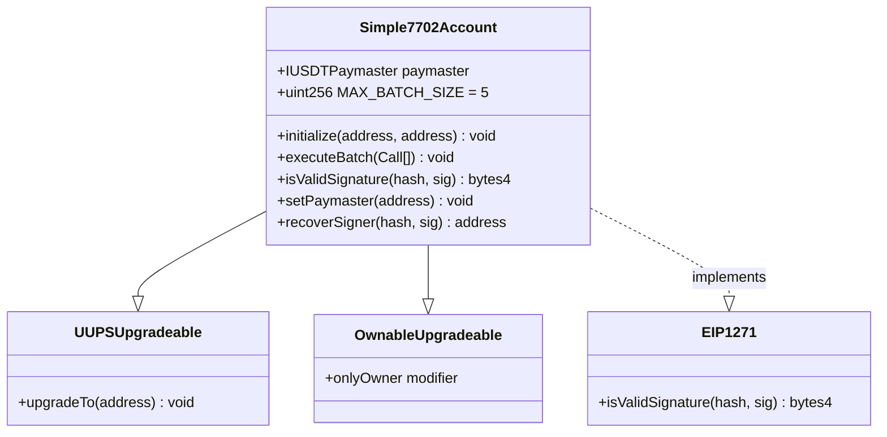

---

## 4. 用户交互流程

### 4.1 新用户完整流程

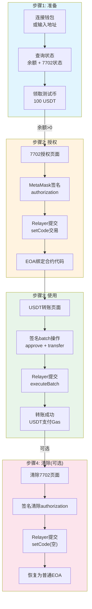

### 4.2 EIP-7702 授权流程

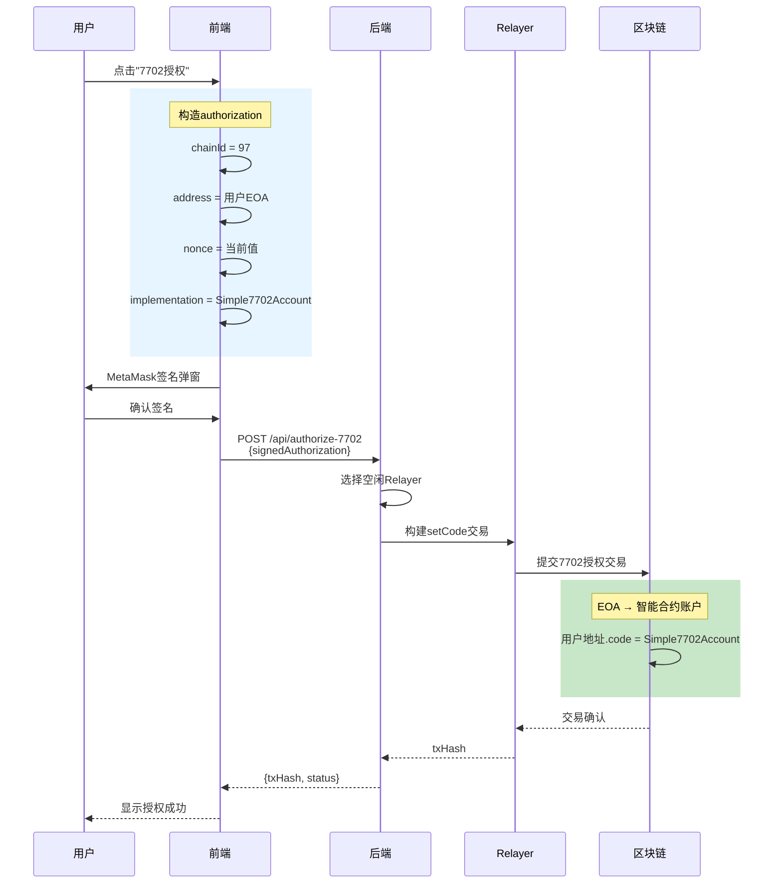

### 4.3 USDT Gasless 转账流程

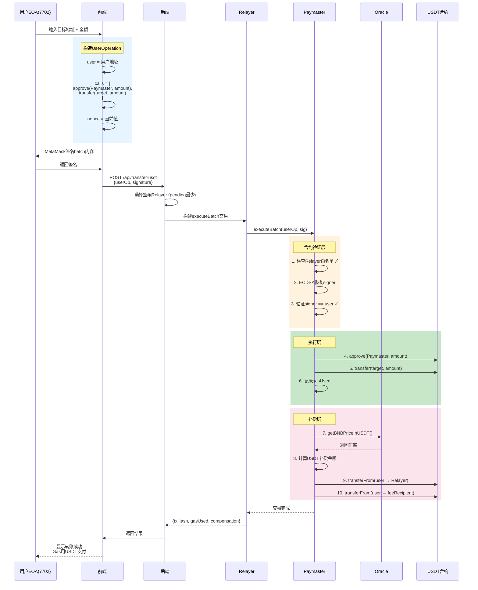

### 4.4 清除 7702 授权流程

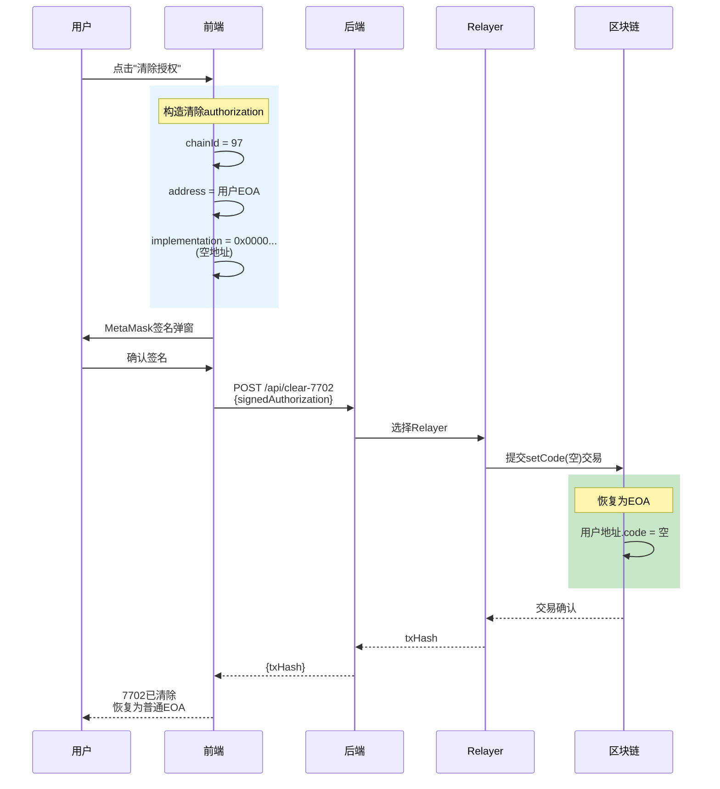

---

## 5. Gas补偿计算

### 5.1 补偿计算流程

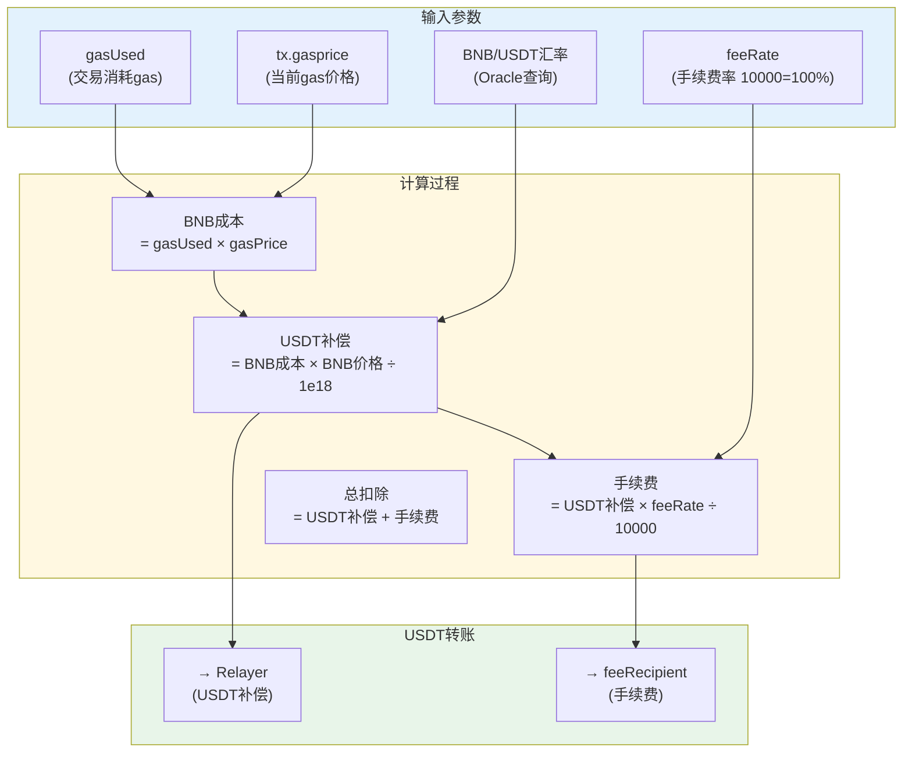

### 5.2 计算公式

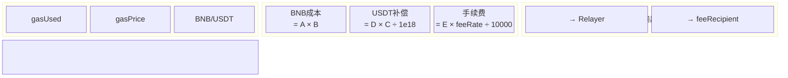

---

## 6. Relayer池设计

### 6.1 Relayer选择策略

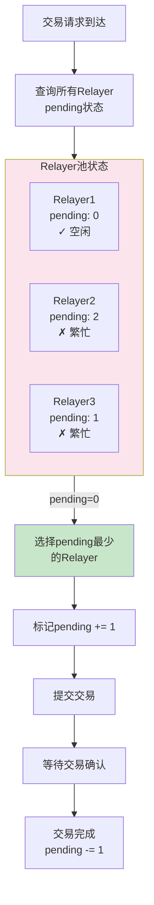

### 6.2 Relayer状态

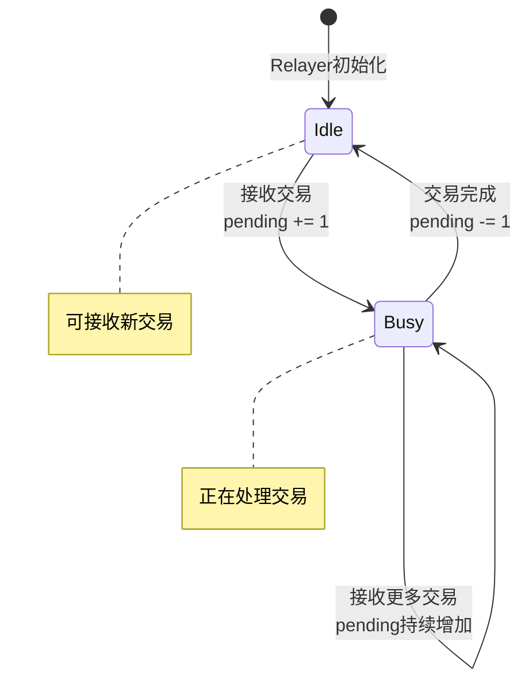

### 6.3 Relayer数据结构

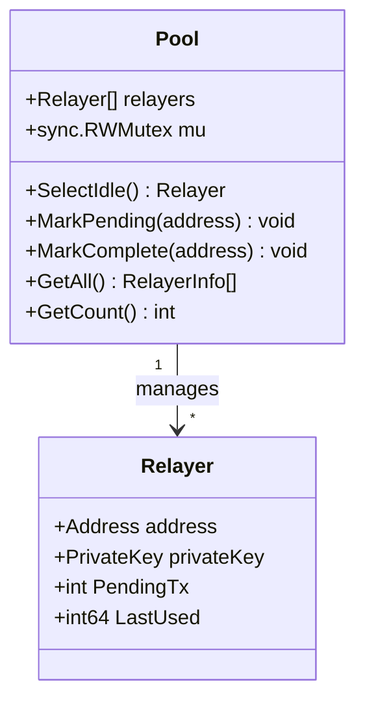

---

## 7. API设计

### 7.1 API端点总览

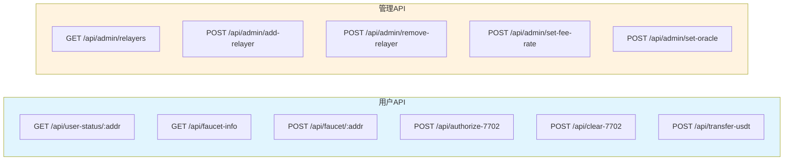

### 7.2 API与合约映射

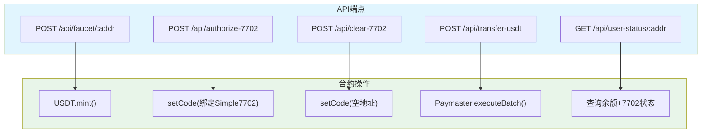

### 7.3 数据结构

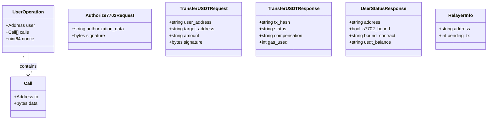

### 7.4 请求响应示例

**USDT转账请求:**
```json
{
  "user_address": "0x84D98c4faa590cD7cA746E18AcF3bcE8AD61E1b2",
  "target_address": "0x1234567890abcdef1234567890abcdef12345678",
  "amount": "100000000000000000000",
  "signature": "0x..."
}
```

**转账响应:**
```json
{
  "tx_hash": "0x4225989b4eceddc429d69b1e24d5b30e4e591bb5f27de86c15e42db2aeb3af7b",
  "status": "success",
  "compensation": "5000000",
  "gas_used": 85000
}
```

---

## 8. 安全设计

### 8.1 多层验证机制

```mermaid
flowchart TB
    subgraph Input["executeBatch输入"]
        UserOp["UserOperation"]
        Sig["用户签名"]
        Caller["调用者(Relayer)"]
    end

    subgraph Layer1["第一层: Relayer验证"]
        V1["检查Relayer白名单"]
        V1Fail["❌ NotRelayer错误"]
    end

    subgraph Layer2["第二层: 签名验证"]
        V2["ECDSA恢复signer"]
        V3["验证signer == user"]
        V2Fail["❌ InvalidSignature错误"]
    end

    subgraph Layer3["第三层: 执行验证"]
        E1["遍历执行calls"]
        E2["记录gasUsed"]
        E1Fail["❌ CallFailed错误"]
    end

    subgraph Layer4["第四层: 补偿验证"]
        C1["计算补偿金额"]
        C2["执行USDT转账"]
        C2Fail["❌ TransferFailed错误"]
    end

    Success["✓ 交易完成"]

    Input --> V1
    V1 -->|"失败"| V1Fail
    V1 -->|"成功"| V2
    V2 --> V3
    V3 -->|"失败"| V2Fail
    V3 -->|"成功"| E1
    E1 -->|"失败"| E1Fail
    E1 -->|"成功"| E2 --> C1 --> C2
    C2 -->|"失败"| C2Fail
    C2 -->|"成功"| Success

    style Input fill:#e3f2fd
    style Layer1 fill:#fff8e1
    style Layer2 fill:#fff8e1
    style Layer3 fill:#fff8e1
    style Layer4 fill:#fff8e1
    style V1Fail fill:#ffcdd2
    style V2Fail fill:#ffcdd2
    style E1Fail fill:#ffcdd2
    style C2Fail fill:#ffcdd2
    style Success fill:#c8e6c9
```

### 8.2 权限控制矩阵

```mermaid
flowchart TB
    subgraph Functions["合约方法"]
        EB["executeBatch()"]
        AR["addRelayer()"]
        RR["removeRelayer()"]
        SF["setFeeRate()"]
        SO["setOracle()"]
        SFR["setFeeRecipient()"]
        UP["upgradeTo()"]
    end

    subgraph Roles["权限角色"]
        Relayer["Relayer白名单"]
        Owner["合约Owner"]
    end

    EB -->|"onlyRelayer"| Relayer
    AR -->|"onlyOwner"| Owner
    RR -->|"onlyOwner"| Owner
    SF -->|"onlyOwner"| Owner
    SO -->|"onlyOwner"| Owner
    SFR -->|"onlyOwner"| Owner
    UP -->|"onlyOwner"| Owner

    style Functions fill:#e8f5e9
    style Roles fill:#fff3e0
```

### 8.3 防护措施

```mermaid
mindmap
  root((安全防护))
    签名验证
      EIP-7701 authorization
      EIP-1271 智能合约签名
      ECDSA 恢复验证
    重放攻击
      chainId 包含在hash
      nonce 防止重复
      签名唯一性
    权限控制
      Relayer白名单
      Owner管理权限
      UUPS升级保护
    重入攻击
      ReentrancyGuard
      nonReentrant修饰符
    升级安全
      _authorizeUpgrade
      仅Owner可升级
```

---

## 9. 前端页面设计

### 9.1 页面结构

```mermaid
flowchart TB
    subgraph Pages["页面路由"]
        Home["/ 首页<br/>用户状态"]
        Faucet["/faucet<br/>水龙头"]
        Auth["/authorize<br/>7702授权"]
        Clear["/clear<br/>清除授权"]
        Transfer["/transfer<br/>USDT转账"]
        Admin["/admin<br/>管理页面"]
    end

    Home -->|"领取USDT"| Faucet
    Home -->|"授权钱包"| Auth
    Home -->|"清除授权"| Clear
    Home -->|"转账USDT"| Transfer
    Home -->|"管理员"| Admin

    style Pages fill:#e1f5fe
```

### 9.2 首页状态展示

```mermaid
flowchart LR
    subgraph HomePage["首页组件"]
        AddrInput["地址输入框"]
        QueryBtn["查询按钮"]
        
        subgraph Status["状态展示"]
            BoundBadge["7702绑定状态<br/>已绑定/未绑定"]
            USDTBal["USDT余额<br/>显示数值"]
        end
        
        subgraph Actions["快捷操作"]
            FaucetBtn["水龙头"]
            AuthBtn["授权"]
            ClearBtn["清除"]
            TransferBtn["转账"]
        end
    end

    AddrInput --> QueryBtn --> Status --> Actions

    style HomePage fill:#e1f5fe
    style Status fill:#c8e6c9
    style Actions fill:#fff3e0
```

### 9.3 转账页面流程

```mermaid
flowchart TB
    subgraph TransferPage["转账页面"]
        PrivKey["私钥输入<br/>(本地使用)"]
        Target["目标地址"]
        Amount["转账金额"]
        
        subgraph Preview["预估信息"]
            EstGas["预估Gas"]
            EstComp["预估USDT补偿"]
            EstFee["预估手续费"]
        end
        
        SignBtn["签名按钮"]
        SubmitBtn["提交按钮"]
        Result["交易结果"]
    end

    PrivKey --> Target --> Amount --> Preview --> SignBtn --> SubmitBtn --> Result

    style TransferPage fill:#e1f5fe
    style Preview fill:#fff8e1
```

---

## 10. 数据流图

```mermaid
flowchart LR
    subgraph UserInput["用户输入"]
        Priv["私钥(本地)"]
        Addr["地址"]
        Amnt["金额"]
    end

    subgraph Frontend["前端处理"]
        BuildOp["构建UserOperation"]
        SignOp["签名操作"]
        SignAuth["签名authorization"]
    end

    subgraph Backend["后端处理"]
        SelectR["选择Relayer"]
        BuildTx["构建交易"]
        Monitor["监控状态"]
    end

    subgraph Blockchain["链上执行"]
        Verify["验证签名"]
        Exec["执行calls"]
        Comp["计算补偿"]
        Transfer["USDT转账"]
    end

    subgraph Output["输出"]
        TxHash["交易哈希"]
        GasUsed["Gas消耗"]
        USDTComp["USDT补偿"]
    end

    Priv --> SignOp --> Backend
    Priv --> SignAuth --> Backend
    Addr --> BuildOp --> Backend
    Amnt --> BuildOp --> Backend
    
    Frontend -->|"HTTP"| Backend
    Backend -->|"RPC"| Blockchain
    Blockchain --> Output

    style UserInput fill:#e1f5fe
    style Frontend fill:#fff3e0
    style Backend fill:#f3e5f5
    style Blockchain fill:#e8f5e9
    style Output fill:#c8e6c9
```

---

## 11. 用户7702生命周期

```mermaid
stateDiagram-v2
    [*] --> EOA: 用户创建EOA

    EOA --> AuthPending: 提交7702授权
    AuthPending --> Auth7702: 交易确认
    AuthPending --> EOA: 交易失败

    state Auth7702 {
        [*] --> Bound
        Bound --> Executing: 执行batch操作
        Executing --> Bound: 操作完成
    }
    
    Auth7702 --> TransferReady: 可执行Gasless转账
    TransferReady --> TransferReady: 转账成功
    TransferReady --> TransferReady: 转账失败(Retry)

    Auth7702 --> ClearPending: 提交清除
    ClearPending --> EOA: 清除成功
    ClearPending --> Auth7702: 清除失败

    note right of EOA: 纯EOA状态<br/>需要BNB支付gas
    note right of Auth7702: 已绑定合约<br/>可用USDT支付gas
    note right of TransferReady: 无需BNB<br/>USDT支付Gas
```

---

## 12. 后端架构

```mermaid
flowchart TB
    subgraph Backend["Go后端"]
        subgraph API["API层"]
            Handlers["Handlers<br/>(Gin)"]
            Models["Models<br/>(请求/响应)"]
        end
        
        subgraph Business["业务层"]
            Pool["Relayer Pool<br/>(选择策略)"]
            Selector["Selector<br/>(负载均衡)"]
        end
        
        subgraph Contract["合约层"]
            PaymasterC["Paymaster<br/>(合约交互)"]
            USDTC["USDT<br/>(合约交互)"]
            OracleC["Oracle<br/>(合约交互)"]
        end
        
        subgraph Eth["以太坊层"]
            Client["Eth Client<br/>(RPC)"]
            TxBuilder["Tx Builder<br/>(交易构建)"]
        end
    end

    API --> Business --> Contract --> Eth

    style Backend fill:#fff3e0
    style API fill:#e1f5fe
    style Business fill:#f3e5f5
    style Contract fill:#e8f5e9
    style Eth fill:#c8e6c9
```

---

## 13. 扩展计划

### 13.1 开发阶段

```mermaid
timeline
    title AA Wallet 开发计划
    
    section Phase 1 (当前)
        基础合约部署 : ✅ 完成
        后端API实现 : ✅ 完成
        前端页面 : ✅ 完成
        水龙头功能 : ✅ 完成
        7702授权 : 🔄 待完善
        USDT转账 : 🔄 待完善
    
    section Phase 2 (未来)
        多签钱包 : ⬜ 计划中
        批量转账 : ⬜ 计划中
        交易历史 : ⬜ 计划中
        移动端App : ⬜ 计划中
        多链支持 : ⬜ 计划中
    
    section Phase 3 (生产)
        主网部署 : ⬜ 计划中
        安全审计 : ⬜ 计划中
        Relayer网络 : ⬜ 计划中
        监控告警 : ⬜ 计划中
```

### 13.2 功能扩展路线

```mermaid
flowchart LR
    subgraph Current["Phase 1: MVP"]
        C1["单账户7702"]
        C2["USDT支付Gas"]
        C3["基础水龙头"]
    end
    
    subgraph Future["Phase 2: 增强"]
        F1["批量转账"]
        F2["交易历史"]
        F3["多签支持"]
    end
    
    subgraph Production["Phase 3: 生产"]
        P1["主网部署"]
        P2["安全审计"]
        P3["分布式Relayer"]
    end
    
    Current --> Future --> Production

    style Current fill:#c8e6c9
    style Future fill:#fff8e1
    style Production fill:#e3f2fd
```

---

## 14. 配置文件

### 14.1 后端配置

```mermaid
flowchart LR
    subgraph Env["环境变量"]
        RPC["BSC_RPC_URL"]
        Keys["RELAYER_PRIVATE_KEYS<br/>(逗号分隔)"]
        USDT["CONTRACT_USDT"]
        Paymaster["CONTRACT_PAYMASTER"]
        Oracle["CONTRACT_ORACLE"]
        Port["PORT=8080"]
    end

    style Env fill:#fff8e1
```

**.env 示例:**
```env
BSC_RPC_URL=https://bnb-testnet.g.alchemy.com/v2/YOUR_KEY
RELAYER_PRIVATE_KEYS=key1,key2,key3
CONTRACT_USDT=0x0cF1130E64744860cbA5f992008527485C88F3C8
CONTRACT_PAYMASTER=0xA61D461AF55029B58d4846C9EA818De9cBC711D3
CONTRACT_ORACLE=0x18CC7E9CF8f40dd32Aa0fafD5FfE938B88E455a4
PORT=8080
```

### 14.2 前端配置

**.env.local 示例:**
```env
NEXT_PUBLIC_BACKEND_URL=http://localhost:8080
NEXT_PUBLIC_USDT_ADDRESS=0x0cF1130E64744860cbA5f992008527485C88F3C8
NEXT_PUBLIC_PAYMASTER_ADDRESS=0xA61D461AF55029B58d4846C9EA818De9cBC711D3
```

---

## 15. 测试计划

### 15.1 测试层次

```mermaid
flowchart TB
    subgraph Tests["测试层次"]
        ContractTest["合约测试<br/>forge test"]
        APITest["API测试<br/>curl/Postman"]
        IntegrationTest["集成测试<br/>完整流程"]
        E2ETest["端到端测试<br/>前端+后端+链"]
    end

    ContractTest --> APITest --> IntegrationTest --> E2ETest

    style Tests fill:#fff8e1
```

### 15.2 测试场景

```mermaid
flowchart LR
    subgraph Scenarios["测试场景"]
        S1["新用户领取USDT"]
        S2["用户7702授权"]
        S3["Gasless转账"]
        S4["清除7702"]
        S5["Relayer切换"]
        S6["手续费设置"]
    end

    style Scenarios fill:#e8f5e9
```

---

## 附录：关键参数汇总

| 参数 | 值 | 描述 |
|------|------|------|
| MAX_BATCH_SIZE | 5 | 单次batch最多操作数 |
| FAUCET_AMOUNT | 100 USDT | 水龙头每次领取金额 |
| feeRate默认值 | 0 | 手续费率 (10000=100%) |
| decimals | 18 | USDT精度 |
| Chain ID | 97 | BSC测试网 |
| Gas补偿精度 | 1e18 | BNB 18位精度转换 |

---

**文档结束**