# AA Wallet 技术设计文档

> 基于 EIP-7702 的 AA 钱包，实现无感授权和 USDT 支付 gas

---

## 1. 系统架构图

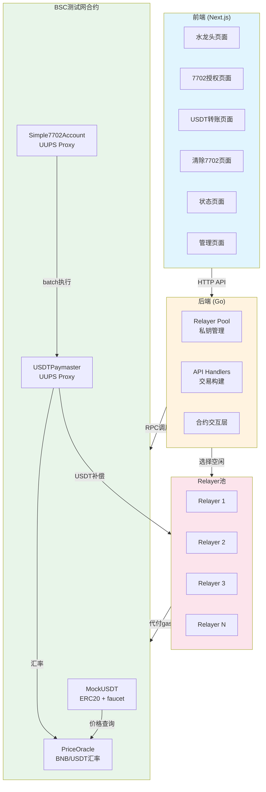

---

## 2. 合约部署依赖图

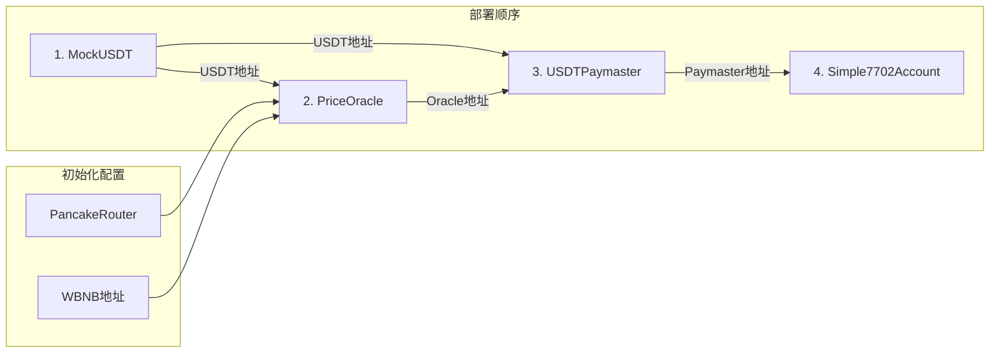

---

## 3. EIP-7702 授权流程

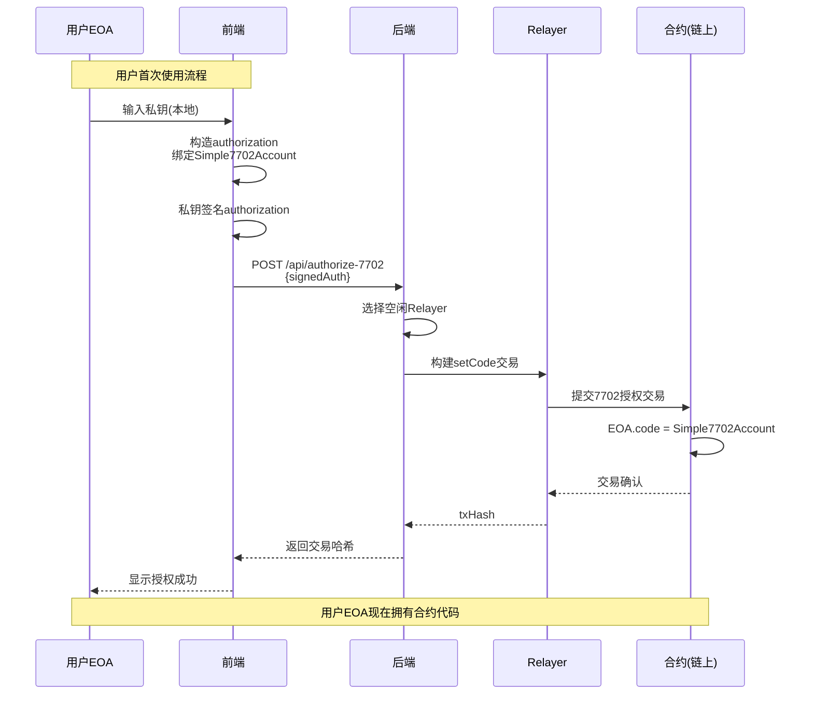

---

## 4. USDT转账流程 (无感授权 + Gas补偿)

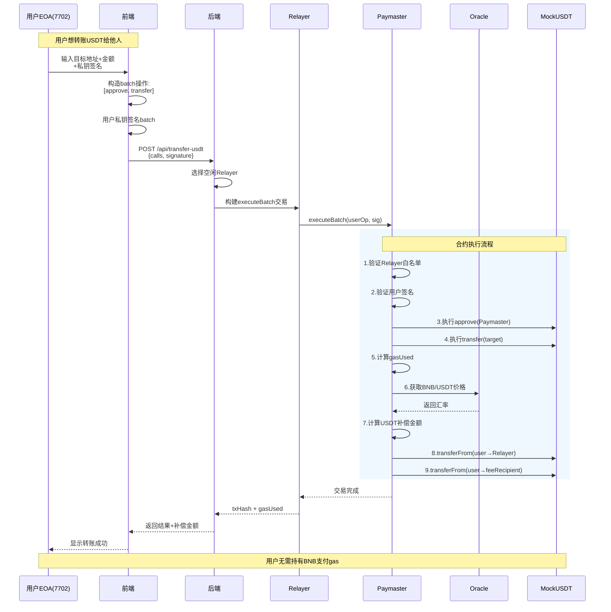

---

## 5. Gas补偿计算流程

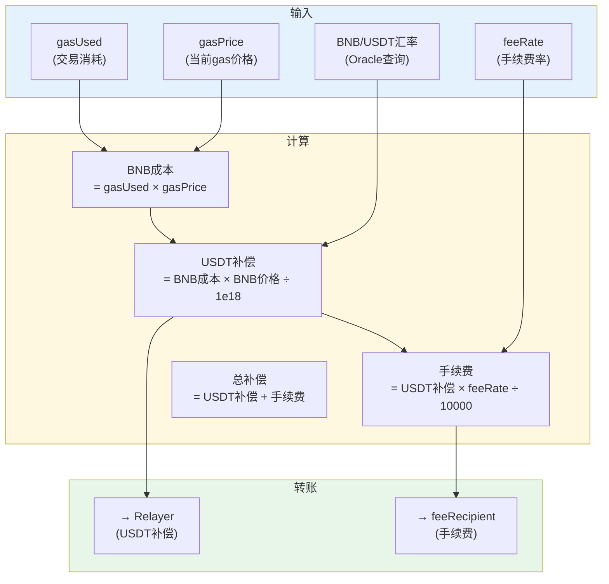

---

## 6. Relayer选择流程

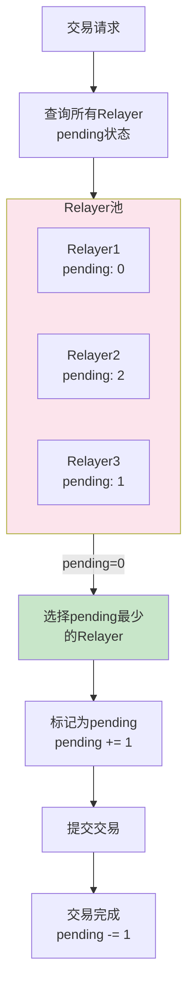

---

## 7. 数据流图

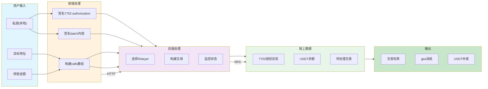

---

## 8. 合约调用关系图

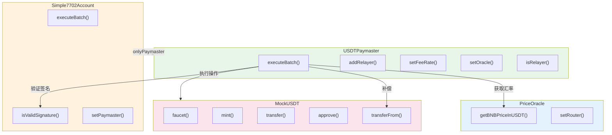

---

## 9. API接口映射图

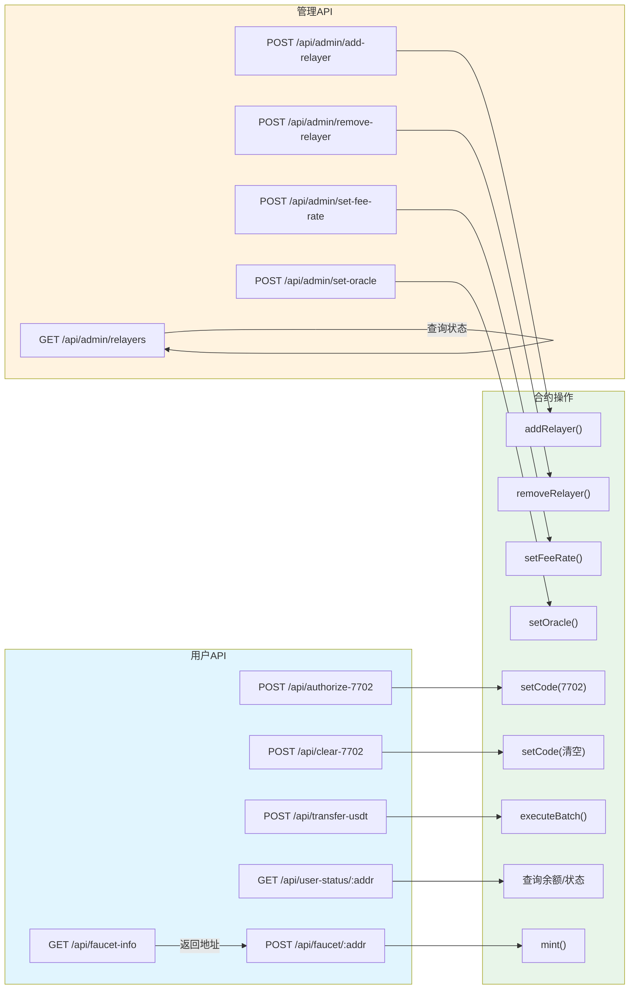

---

## 10. 安全验证流程

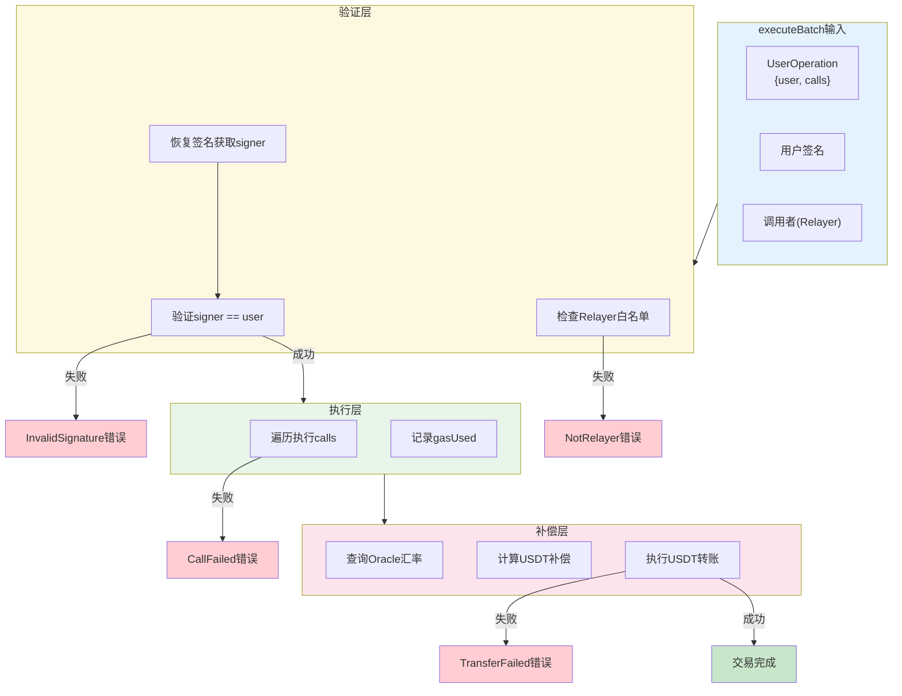

---

## 11. 前端页面流程

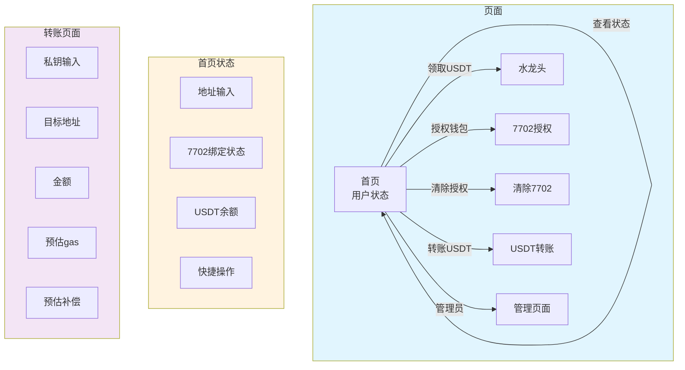

---

## 12. 状态机：用户7702生命周期

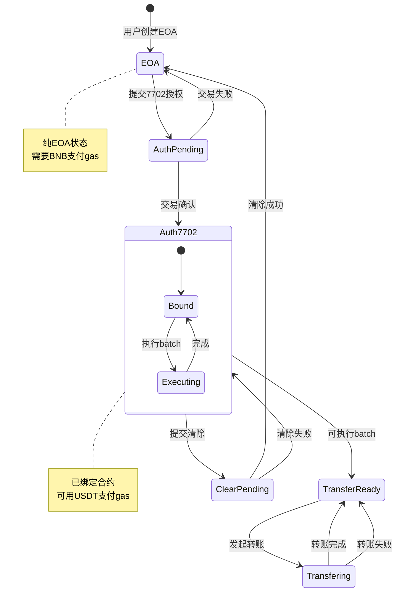

---

## 附录：合约地址配置

| 合约 | 描述 | 依赖 |
|------|------|------|
| MockUSDT | ERC20代币，带faucet | 无 |
| PriceOracle | BNB/USDT汇率 | PancakeRouter, WBNB, USDT |
| USDTPaymaster | UUPS代理，执行batch | USDT, Oracle |
| Simple7702Account | UUPS代理，用户合约 | Paymaster |

---

## 附录：关键参数

| 参数 | 值 | 说明 |
|------|------|------|
| MAX_BATCH_SIZE | 5 | 单次batch最多操作数 |
| FAUCET_AMOUNT | 100 USDT | 每次领取金额 |
| feeRate | 0 (默认) | 手续费率 (10000=100%) |
| 汇率精度 | 1e18 | BNB 18位精度 |

---

**文档版本**: v1.0
**生成日期**: 2026-05-15
**适用网络**: BSC测试网